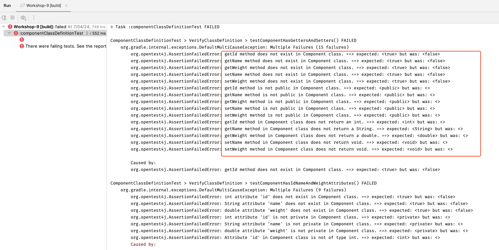

# Taller 9 - Diagramas de Clases y Cadena de Responsabilidad

## Pre-requisitos
Para poder realizar este taller se deben poder ejecutar las pruebas configuradas que van a validar la implementación de los métodos de las clases. Hay dos opciones que puede usar:

Para cualquiera de las dos opciones, es necesario que:
1. Clone el repositorio del curso en su máquina.
2. Abra el proyecto en intellij.
3. Ejecute las pruebas del proyecto a través de intellij o de la consola.

### Opción Usando intellij directamente:
Para configurar el proyecto en intellij y poder ejecutar las pruebas, siga los siguientes pasos:

1. Junto al botón de play debería aparecer un menú desplegable ahí encontrará la opción _Editar configuraciones_ o _Edit Configurations, haga click en este menú.

2. Esto abrirá una ventana emergente, haga click en el botón de + y seleccione la opción _Gradle_.


3. En la configuración que se crea, en el campo _Tasks_ escriba o seleccione _build_ y haga click en _Apply_ y luego en _Ok_.


### Opción Usando la consola:

En el caso de querer usar la consola, ejecute el siguiente comando en la raíz del proyecto 
(Recuerde que la consola se encuentra en la parte inferior de intellij):

```bash
./gradlew build
```


## Ejecución de las pruebas
Sea cual sea la opción que haya elegido, puede ejecutar las pruebas del proyecto haciendo click en el botón de play de intellij o con el comando de la consola.
Al hacerlo, se encontrará con una pantalla similar a la siguiente:


Fíjese que todas las pruebas fallan. Esto es porque aún no se ha implementado ninguna de las funcionalidades que implementará en el taller.
Además, en el recuadro rojo puede observar que las pruebas al fallar le indican qué es lo que se espera que tenga su implementación.
A medida que vaya implementando las funcionalidades, las pruebas fallidas irán desapareciendo, hasta que el código esté completo y todas las pruebas pasen.


## Catalogo de robots

## Definición de clases (1.5)

Defina las clases _[Component](./src/main/java/com/javeriana/model/Component.java)_, 
_[Robot](./src/main/java/com/javeriana/model/Robot.java) y [Catalog](./src/main/java/com/javeriana/model/Catalog.java)_ según el siguiente diagrama de clases UML.
**En este punto solo es necesario que defina los atributos y métodos de las clases, no es necesario que implemente la funcionalidad de los métodos aún.**


## Definición de métodos (3.5)
Para cada una de las clases deben implementerse los siguientes métodos:

### Component
Implemente las siguientes funcionalidades en la clase _[Component](./src/main/java/com/javeriana/model/Component.java)_:
1. getters para todos los atributos y setters para todos los atributos con excepción del atributo _id_.
2. Un constructor que reciba como parámetros todos los atributos de la clase.

### Robot
Implemente las siguientes funcionalidades en la clase _[Robot](./src/main/java/com/javeriana/model/Robot.java)_:
1. getters para todos los atributos y setters para todos los atributos excepto para la lista de componentes.
2. Un constructor por parámetros que reciba el atributo _code_ y _maxWeight_. Este constructor debe dejar la lista de componentes inicializada pero vacía
3. Un método llamado _addComponent_ que reciba como parámetros los atributos de un componente y lo agregue a la lista de componentes del robot.
Este método debe retornar un _booleano_ que indique si el componente fue agregado o no. **Un componente no puede ser agregado si el peso total de los componentes del robot supera el peso máximo del robot.**
4. Un método llamado _getComponentsWeight_ que retorne el peso total de los componentes del robot.

### Catalog
Implemente las siguientes funcionalidades en la clase _[Catalog](./src/main/java/com/javeriana/model/Catalog.java)_:
1. getters para todos los atributos.
2. Un constructor por defecto que inicialice la lista de robots vacía.
3. Un método llamado _searchRobotByCode_ que busque un robot según su código. Debe retornar el robot o null en caso de no encontrarlo.
4. Un método llamado _addRobot_ que reciba por parámetro toda la información de un robot y lo agregue a la lista de robots (sin componentes). 
Este método debe retornar un _booleano_ que indique si el robot fue agregado o no. **Un robot no puede ser agregado si ya existe un robot con el mismo código.**
5. Un método llamado _addComponentToRobot_ que reciba por parámetro el código de un robot y toda la información de un componente.
Este método debe agregar el componente al robot correspondiente. Este método debe retornar un _booleano_ que indique si el componente fue agregado o no. **Un componente no puede ser agregado si el peso total de los componentes del robot supera el peso máximo del robot o si el robot no existe**.
6. Un método llamado _removeRobot_ que elimine un robot de acuerdo al atributo _code_.
Este método debe retornar un _booleano_ que indique si el robot fue eliminado o no. **Un robot no puede ser eliminado si existe en la lista de robots**.
7. Un método llamado _getComponentsNamesUsedInAllRobots_ que retorne una lista con los nombres de todos los componentes usados en los robots del catálogo. **Esta lista no debe incluir nombres repetidos**.
    